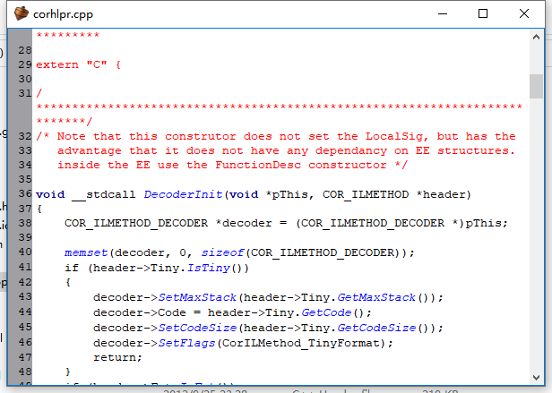
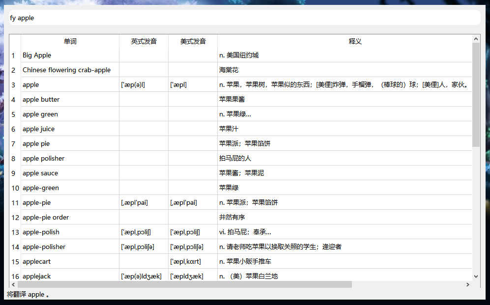

# **QuickWin**

### 关于

QuickWin是一款用于Windows平台的集多种便捷功能于一体的软件，其中主要功能包括
* [查看硬件信息](#1.1)

* [网速监控](#1.2)

* [屏幕保护](#1.3)

* [屏幕亮度与对比度调节](#1.4)

* [便捷预览文件](#1.5)

* [截图工具](#1.6)

* [便利贴](#1.7)

* [颜色拾取](#1.8)

* [任务管理器](#1.9)

* [Windows实用工具](#1.10)

* [定时提醒](#1.11)

* [热键管理](#1.12)

* [自选股](#1.13)

* [搜索工具](#1.14)

* [划词翻译](#1.15)

 
右键菜单
 

***

#### 查看硬件信息

基于[openhardwaremonitor](https://github.com/openhardwaremonitor/openhardwaremonitor)，我们使用C++完成了对硬件信息的实时监控，并能够直接查看本机的配置信息。

查看硬件信息主界面
 

悬浮窗的硬件信息
 

------

#### 网速监控

基于[TrafficMonitor](https://github.com/zhongyang219/TrafficMonitor)，我们完成了对本地主机上的网速进行实时监控，并能够自定义设置悬浮窗。

 
悬浮窗的网速监控
 

 
任务栏的网速监控
 

------

#### 屏幕保护

基于[TimeProtection](https://github.com/maplefan/TimeProtection)，我们能够自定义设置屏幕保护，默认使用的屏幕保护程序能够在您一段时间没有操作电脑后显示当前的日期以及时间。

 
屏幕保护效果图
 

------

#### 屏幕亮度与对比度调节

我们能够不用操控硬件即改变屏幕亮度和屏幕对比度，且支持多屏情况。

 
设置屏幕亮度与屏幕对比度
 

 
多个屏幕时选择屏幕
 

------

#### 便捷预览文件

基于C#完成的[QuickLook](https://github.com/QL-Win/QuickLook)提供的dll，我们使用C++将MacOS上的一个功能带到了Windows上，即使没有安装该拓展名对应的任何程序，它也允许用户在鼠标选中一个文件/文件夹的情况下，轻按空格键即可快速预览文件，为您管理Windows上的文件提供方便。

目前暂时仅仅支持如下格式：

* pdf文件（.pdf）

* markdown文件（.md、.markdown）

* HTML文件（.html、.htm）

* 图片文件（.png、.jpg、.jpeg、.bmp、.gif）

* 音频文件（.mp3、.wma）

* 视频文件（.mp4、.mkv）

* 文本文件（.txt、.c、.cpp、.hpp、.h、.java、.cs、.py、.js、.css、.xml）部分代码文件支持高亮

* 快捷方式文件（.lnk）

其他格式的文件轻按空格后将会显示文件信息。

pdf格式预览
 

markdown格式预览
 

html格式预览
 

图片预览
 

音频预览
 

视频预览
 

纯文本预览
 

快捷方式预览
 

文件夹预览
 

------

#### 截图工具

只要运行了该程序，您可以使用方便快捷的截图工具，且能直接将截下来的图一直摆在桌面上。

截图工具
 

将截图钉在桌面上
 

------

#### 便利贴

可以用来记录一些待办事项放在桌面上以便提醒自己。

便利贴
 

------

#### 颜色拾取

能够测出电脑屏幕上任一像素点的RGB值。

颜色拾取
 

------

#### 任务管理器

能够通过该任务管理器找到进程对应路径，且支持人为结束、阻塞、恢复进程，可以便捷的查看进程的模块、线程等详细信息。

任务管理器进程列表
 

任务管理器窗口信息
 

------

#### Windows实用工具

集合了Windows上常用的一些功能，可以快速的抵达对应Windows界面。

目前支持下列功能：

* 常用（命令提示符、LinuxShell（若支持的情况下）、PowerShell、任务管理器、注册表、服务管理、计算机名、环境变量、程序管理、计算器、快速重启、快速关机、控制面板、结束资源管理器、重启资源管理器）

* 配置（系统信息、系统版本、桌面图标、计划任务、设备管理、磁盘管理、时间日期、壁纸、ClearType设置）

* 性能和安全（凭据管理、UAC设置、用户管理、安全策略、组策略、事件查看、性能监视、性能设置、资源监视、电源设置、证书管理、内存诊断）

* 网络（Hosts文件、代理设置、防火墙、IP v6、IP v4、路由表、网络连接、共享文件夹、清除DNS缓存）

Windows实用工具界面
 

------

#### 定时提醒

能够在设置的时间提醒您对应的事情，以防忘记一些重要的事情。当然，工作和学习的时候记得每隔一段时间站起来动一动身体哦~

定时提醒界面

------

#### 热键管理

基于[OpenArk](https://github.com/BlackINT3/OpenArk)，将热键管理功能移植到了QuickWin上，能够方便的查看本地主机上每个热键分别被哪个进程所占用。

热键管理界面

------

#### 自选股

能够即时查看设置的股票价格，且能够在达到设置的价格时提醒你。

自选股界面

------

#### 搜索工具

基于[Everything](www.voidtools.com)，能够快速搜索本机上的文件所在位置，也支持查单词、百度搜索、谷歌搜索、必应搜索等功能。

使用Ctrl+空格键可唤出搜索框或隐藏搜索框。

输入任意字符可在本地磁盘上快速搜索到包含该字符的前100个文件。

输入“fy apple”可使用翻译功能翻译apple。

输入“bd Maplestory”并轻按回车键可使用百度搜索引擎搜索Maplestory。

输入“by Maplestory”并轻按回车键可使用必应搜索引擎搜索Maplestory。

输入“gg Maplestory”并轻按回车键可使用谷歌搜索引擎搜索Maplestory。

输入“cmd ping www.maplefan.com”并轻按回车键可使用命令行执行“ping www.maplefan.com”指令。

搜索本地主机上的文件

使用fy指令搜索单词

使用bd指令搜索Maplestory

使用cmd指令ping www.maplefan.com

------

#### 划词翻译

基于[Translator](https://github.com/mario206/Translator)，能够在开启该功能时实现划词翻译功能。

使用Ctrl+3开启划词翻译功能，再次使用Ctrl+3会关闭划词翻译功能。

当开启划词翻译时，会呼唤出和你打招呼的小猫。

开启划词翻译

当关闭划词翻译时，会呼唤出和你哭泣挥手的小猫。

关闭划词翻译

使用Ctrl+3开启划词翻译后，只需要用鼠标选中一个单词便会自动出现该单词的翻译界面，且部分单词支持朗诵。

当不想使用翻译功能时，请使用Ctrl+3关闭划词翻译功能，以免选中任何文本都会弹出翻译框。

使用划词翻译

------

#### 设置

可以设置开机自启动、语言（暂时支持简体中文、繁体中文、英文三种语言）、自选股颜色、字体、快捷键、数据轮播时间、悬浮窗显示内容、任务栏显示内容、悬浮窗和任务栏快捷动作等功能。

常规设置界面

主窗口设置界面

任务栏设置界面

------

